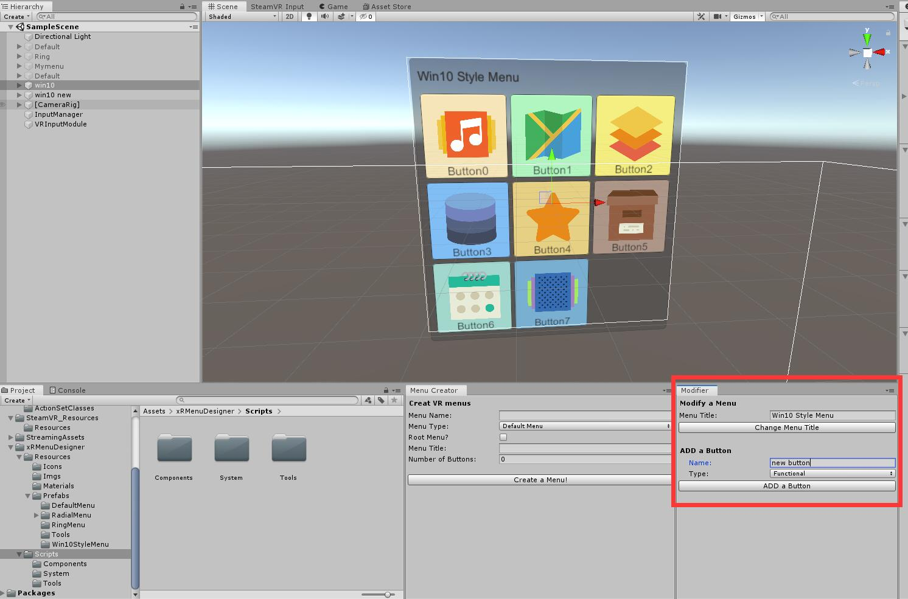

# VRMenuDesigner: A toolkit for automatically generating and modifying VR menus 

arXiv: https://arxiv.org/abs/2109.10172

## 0. Introduce
This project is a toolkit for auto creating/modifying xR User Interface in Unity3D and htc Vive. Users can conveniently generate multiple types of UI by our toolkit.

toolkit overview:


Here is some UI demos generated by our tool:

*(1) Default Menu*


*(2) Win10Style Menu*


*(3) Ring Menu*


*(4) Radial(Pie) Menu*


-------------------

## 1. Quick Start

### 1.0 Initialize work environment

1. Create a new Unity3D project and remove **Main Camera** in Hierarchy.

2. import **SteamVR** plugin by Asset Store and drag **[CameraRig]** to Hierarchy ([a good Vive tutorial](https://www.raywenderlich.com/9189-htc-vive-tutorial-for-unity)). Then add 3 Actions in SteamVR input window:


  

Click **Save and generate**, then click **Open binding UI** to config actions.


Click **Replace default binding** to save.

3. import **xRMenuDesigner** and into Assets/xRMenuDesigner/Resources/Prefabs/Tools/
* drag **InputManager**, **VRInputMoudule** to Hierarchy root,
* drag **RayPointer** to Hierarchy [CameraRig]/Controller(right). This pointer is used to interact with the menus.


* drag VRInputMoudule to RayPointer **Input Module** field.


* config **InputManager**:


* config **VRInputMoudule**


4. you can see our tools appear in the menu bar:


* **Menu Creator**: Custom menu type, number of buttons, and create menu into Hierarchy.
* **Modifier**: Select Menu or Button in Scene or Hierarchy, and change the properties of menus or buttons 

Click MenuDesigner->Menu Creator and Modifier, then drag them to the appropriate location such as this:


You have configured your working environment, let's start using it!

### 1.1 Creator
Let's create our first menu. First, Customize properties of new menu in Creator:


* **Menu Name:** Menu Object name in Hierarchy 


* **Menu Type:** Menu type, such as Default, Windows 10 style, Ring and so on.
* **Root Menu?:** If a Menu is Root, it will always display in the scene; otherwise, it only shows up when it is triggered.
* **Menu Title:** The title of new Menu, usually it will be displayed in the upper left corner of the menu.
* **Number of Buttons:** The number of button of new menu, usually it is limited between 0 and a maximum.

We choice Default Type menu, and assign 4 buttons to it. Next step is  customize every buttons properties. 

Once you have entered the number of buttons, the corresponding number properties list will appear automatically below. You can customize the properties of each button one by one. Of course, you can also modify them with the Modifier after the menu is created.


For each button, you can customize its name, type, icon. if Type is SubMenus, you can define submenus that are triggered by this button (just drag submenus from Hierarchy and drop it into Sub Menu Ref field).

This is a menu that has just been created:

   

Don't forget to drag the RayPointer to the event of the menu

   


The first menu is created successfully, you can run the game test it.


***Introduction to Menu type***
* **Default Menu**. Looks as shown in the picture above. This menu consists of up to 20 buttons, and each button can trigger a function or submenu.

* **Win10Style Menu**. Looks similar to Windows 10 Start Menu. Allow buttons to trigger sub menus, up to 9 buttons per menu, and each button can trigger a function or submenu.


* **Ring Menu**. The menu is displayed around and follow the user. Up to 20 buttons, and buttons cannot trigger submenus.

Do not forget Configure HMD reference to ring:

***Recommended usage***: We made a RingMenu controller using the Radial menu. **Top**:  Enable/Disable Ring Menu, **Right/Left**: Manually rotate the Ring, **Bottom**: Fix/Cancel Rotate follow HMD.   How to use it: First, add a script component "Radial2Ring" in Radial Menu Inspector, then drag target Ring Menu and Camera into it. then config Events as the picture shows.  


* **Radial Menu**. Have up, down, left and right four buttons, triggered by the touchpad of the Vive Controller.

After creating it, drag it to **Controller(right)** and configure the **InputManager**


### 1.2 Modifier

You can use the Modifier to modify the created UI.

* Modify a **menu**: select a menu in Hierarchy or Scene, and move mouse in Modifier. You can easily modify the menu title or add new buttons to it.



* Modify a **button**: select a menu in Hierarchy or Scene, and move mouse in Modifier. You can easily modify the menu Type, Text and Icon, or remove this.


* Custom button color, Animation zoom(scaleX, Y, Z), and function(On Click).


---------------


## 2. For Developers

* **Classes**: In general, all types of menus and buttons inherit from interface classes: MenuInterface and ButtonInterface. Menu is aggregated by buttons, each type of menu corresponds to a type of button. Therefore, if you want to design new types of menus and buttons in the future, you only need to inherit the interface. This is the UML class diagram of Menu and Button: 


* **How the Creater works**: In short, the principle of a creator is to instantiate classes based on user input. For each creation process, The key code is as follows.
```csharp
// 1. Instantiate Menu Prefab
GameObject MenuPrefab = (GameObject)AssetDatabase.LoadAssetAtPath("Assets/xRMenuDesigner/Resources/Prefabs/DefaultMenu/DefaultMenu.prefab", typeof(GameObject));
/* Customize menu attributes based on user input */
GameObject tempMenu = Instantiate(MenuPrefab);

// 2. Instantiate Button Prefab
for (int i = 0; i < ButtonNum; i++)
{
    GameObject ButtonPrefab = (GameObject)AssetDatabase.LoadAssetAtPath("Assets/xRMenuDesigner/Resources/Prefabs/DefaultMenu/DefaultButton.prefab", typeof(GameObject));
    /* Customize every button attributes based on user input */
    GameObject tempButton = Instantiate(ButtonPrefab, tempMenu.trans);
}
```
The detailed implementation is in *Creater.cs*

* **How the Modifier works**: Unity provides `Selection.activeGameObject` to detect the user's currently selected object in Hierarchy or Scene. We use this tool and object `tag` to determine the type of the currently selected object. Next, switch our Modifier to: modify Menu, Modify Button or nothing. The detailed implementation is in *Modifier.cs*.

